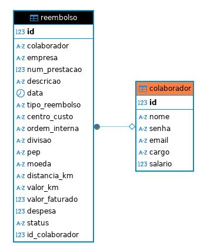

# Sispar-API

# 1. Introdução:

## Descrição geral do projeto

Este é o projeto final do curso de fullstack da Escola Vai na Web. Consiste num sistema de gerenciamento de reembolsos e tem como objetivo ser uma ferramenta de emissão de reembolsos. O usuário pode registrar e alterar informações referentes a reembolsos e enviar para aprovação.

## Funcionalidades do sistema:

- **Registro de transações**: inserção de dados como número da prescrição, data, valores, descrição e categoria.
- **Categorização**: classificação de despesas em categorias como alimentação, transporte, lazer, etc.

## Tecnologias utilizadas no back-end:

- **Python**
- **MySQL**
- **Flask**

## Objetivo da API:

- Sistema de emissão de reembolso.

# 2. EndPoints da API:

Documentação dos principais endpoints (incluindo método HTTP, URL, parâmetros, e exemplo de resposta).
Sistema de Cadastro de Colaboradores:
| Método | URL | Descrição |
| ------ | ---------------------------------------------------- | ----------------------------- |
| POST | /colaborador/cadastrar | Cadastra colaboradores |
| GET | https://sispar-api-kh9p.onrender.com/colaborador/todos-colaboradores | Lista colaboradores |
| PUT | /colaborador/atualizar/<id_colaborador> | Atualiza o colaborador por id |
| DELETE | /deletar/<id_colaborador>| Remove o colaborador por id |
| POST | /colaborador/login | Permite login no sistema |

Sistema de Cadastro de Reembolso:
| Método | URL para testar no Postman| Descrição |
| ------ | ---------------------------------------------------- | ----------------------------- |
| POST | /reembolso/solicitacao | Cadastra solicitação de reembolso |
| GET | https://sispar-api-kh9p.onrender.com/reembolso/reembolsos | Lista reembolsos |
| GET | https://sispar-api-kh9p.onrender.com/reembolso/num_prestacao/<num_processo> | Busca reembolso por número de prestação de serviço |
| DELETE | reembolso/deletar/<num_processo> | Remove o pedido de reembolso por id |
| PUT | /atualizar/<num_processo> | Atualiza o pedido de reembolso por id |

# 3. Autenticação:

# 4. Validação de Dados:

# 5. Como rodar o projeto:

1- Copie o código na máquina local

2- Inicie o ambiente virtual (venv)\
`python3 -m venv venv`

3- Ative o ambiente virtual\
Linux:\
`source venv/bin/activate`\
Windows:\
`venv/Scripts/activate`

4- Instale as dependências para o projeto\
`pip install -r requirements.txt`

5- Execute o flask\
`python run.py`

7- acesse o link pelo navegador para acessar as rotas do Swegger\
http://127.0.0.1:5000/apidocs
